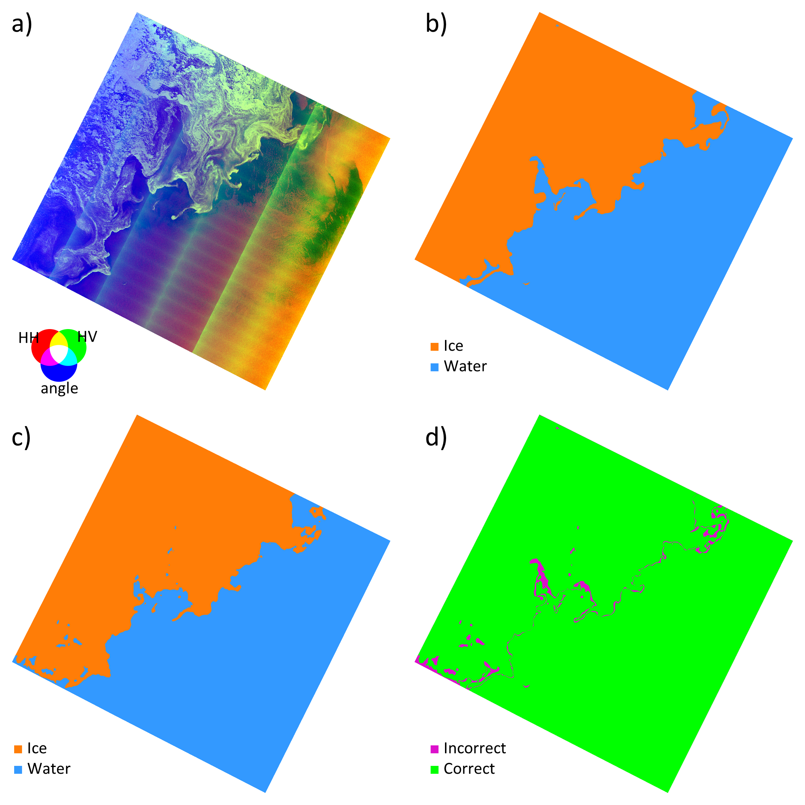

# Sea ice segmentaion using convolutional neural networks

This repository contains scripts that can be used to train convolutional neural network models to segment sea ice using Synthetic Aperture Radar (SAR) images like the following example. 

The models are trained with  three-band rasters as input (a), and labels (rasters) with the same projection and dimensions than the input (b). After training, the model generates outputs (c) using full SAR scenes (a) that can be evaluated agains the original labels (d)

# Getting started
## Using a terminal
Clone this repository to your local machine using your tool of choice. Open the [Anaconda Prompt](https://docs.anaconda.com/anaconda/user-guide/getting-started/) (requires a working [Anaconda](https://www.anaconda.com/) installation):

Then, use the prompt to **navigate to the location of the cloned repository**. Install the [environment](env_exported.yml) using the command:  
`conda env create -f env_exported.yml`

Follow the instructions to activate the new environment:  
`conda activate sea-ice-segment`

We have two environment files: 
- [env_exported](env_exported.yml): the environment exported from  Anaconda's history. This should be enough to replicate the results.
- [env_full](env_full.yml): the full environment installed. This includes more information and might be OS dependent. The experiments were executed using Windows 10 Pro for Workstations, mostly using version 21H2. 

## Data and models
We developed the scripts in this repository using the [Extreme Earth](https://doi.org/10.5281/zenodo.4683174) dataset that provides labels (vector polygons) for the interpretation of sea ice conditions on the East coast of Greenland based on twelve Sentinel-1 images. We use [GDAL](https://gdal.org/) to rasterize the labels ([`rasterize.py`](./utils/rasterize.py)). The [dataloaders](datasets.py) are based in [Xarray](https://docs.xarray.dev/en/stable/) and [rioxarray](https://corteva.github.io/rioxarray/stable/).  

Models were developed using [PyTorch](https://pytorch.org/) and trained using [PyTorch Lighnting](https://www.pytorchlightning.ai/).

## Using the code
Use [`main.py`](main.py) to train the models according to a configuration file (several examples in [configs](./configs/)). Evaluate the models using  [`evaluate.py`](evaluate.py) that also requires [configuration files](./configs/).

One of the arguments in the configuration for [`main.py`](main.py) is `fname_csv` that is the file name for a csv files containing raster identification such as the example in csv [example](./resources/EE_IO-poly_type-all.csv)
